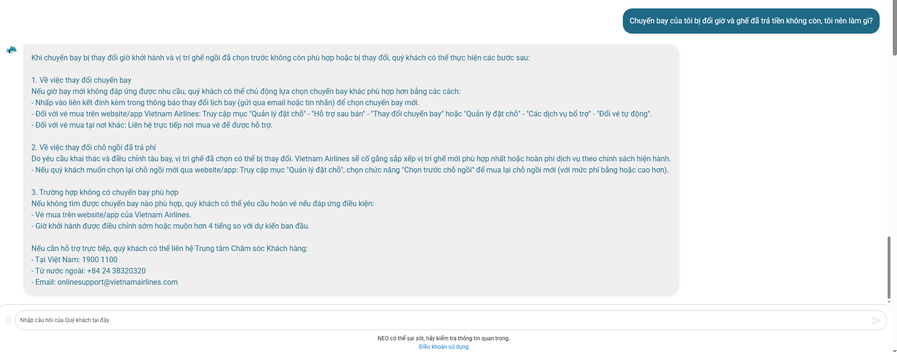

# Workshop - Mổ App AI Thật

## 1. Sản phẩm đã chọn

**Sản phẩm:** Vietnam Airlines - Chatbot NEO  
**AI feature:** Trợ lý ảo hỗ trợ khách hàng về vé, hành lý, chuyến bay, hoàn/đổi vé và góp ý dịch vụ.  
**Người dùng quan sát:** Hành khách phổ thông đã có mã đặt chỗ, cần biết mình phải làm gì khi lịch bay/chỗ ngồi/hành lý có vấn đề.

## 2. Promise vs reality

**Product hứa gì?**  
NEO được giới thiệu là chatbot AI hỗ trợ khách hàng 24/7 trên các kênh chính thức của Vietnam Airlines. Nguồn public của VNA nói NEO có thể hỗ trợ tìm thông tin, đặt vé, kiểm tra chuyến bay và giải đáp thắc mắc về hành lý.

**User nào được hứa sẽ được giúp?**  
Hành khách đang cần câu trả lời nhanh, đặc biệt trong các tình huống cần xử lý trước/sau chuyến bay: đổi lịch, hành lý, check-in, dịch vụ bổ trợ, khiếu nại/góp ý.

**Kỳ vọng AI làm được task nào?**  
Khi user nhập một mô tả tình huống bằng ngôn ngữ tự nhiên, AI nên:

- xác định đúng intent của user;
- hỏi thêm thông tin nếu thiếu mã đặt chỗ, chặng bay, ngày bay hoặc loại vấn đề;
- đưa ra 2-3 bước tiếp theo rõ ràng;
- nói rõ khi nào cần chuyển sang form góp ý, hotline hoặc nhân viên thật.

**Điểm gãy khi dùng thật / quan sát từ evidence public**  
Theo điều khoản sử dụng Chatbot NEO của Vietnam Airlines, câu trả lời của NEO được tạo tự động và không có human review trước. Điều này hợp lý cho FAQ, nhưng rủi ro với các case có tác động cao như mất ghế đã trả tiền, thay đổi lịch bay, hành lý thất lạc hoặc khiếu nại. Nếu bot trả lời quá tự tin mà không bắt user xác nhận thông tin và không chuyển người dùng sang kênh phù hợp, user có thể làm sai bước hoặc chậm xử lý.

## 3. Evidence note

| Evidence | Nguồn | Path liên quan | Điều học được |
|---|---|---|---|
| NEO được giới thiệu là trợ lý ảo hỗ trợ 24/7 và giải đáp các nhóm câu hỏi như tìm thông tin, đặt vé, kiểm tra chuyến bay, hành lý. | Spirit Vietnam Airlines: `https://spirit.vietnamairlines.com/chuyen-dong-vna/chatbot-neo-va-hanh-trinh-nang-tam-trai-nghiem-khach-hang.html` | Happy | Product promise là nhanh và rộng, nhưng slice prototype nên cắt về một flow rất hẹp. |
| Điều khoản NEO nói response được tạo tự động, không có human intervention/prior review. | Vietnam Airlines Terms of Use for NEO Chatbot: `https://www.vietnamairlines.com/ca/en/support/condition-of-chatbot-NEO` | Failure | Cần thiết kế low-confidence và human handoff cho case rủi ro. |
| Trang "Chat ngay cùng NEO" có nhắc nếu cần phản hồi từ Vietnam Airlines thì điền thông tin tại mục Góp ý dịch vụ. | Vietnam Airlines: `https://www.vietnamairlines.com/cn/vi/help-desk/other-topics/Chat-with-vna` | Correction | Correction/recovery nên đưa user đến kênh có ghi nhận chính thức, không chỉ trả lời bằng text. |
| Review public trên Trustpilot có user nói chuyến bay nội địa bị đổi giờ 2.5 tiếng và họ chỉ phát hiện khi đến sân bay. | Trustpilot Vietnam Airlines reviews: `https://www.trustpilot.com/review/vietnamairlines.com` | Failure | Pain không chỉ là "hỏi thông tin", mà là cần biết bước tiếp theo khi thông tin thay đổi/không rõ. |

**Screenshot:** 
## 4. Four paths

| Path | NEO/to-be cần thể hiện gì? |
|---|---|
| Happy | AI nhận ra case "lịch bay/chỗ ngồi bị thay đổi", hỏi mã đặt chỗ nếu cần, trả về checklist 3 bước: kiểm tra PNR, lưu bằng chứng, liên hệ kênh hỗ trợ/chính sách liên quan. |
| Low-confidence | Nếu user mô tả mơ hồ như "tôi bị mất ghế", AI hỏi lại: đã thanh toán cho ghế chưa, chuyến bay nào, thay đổi do hãng hay do user? |
| Failure | Nếu AI đưa hướng dẫn sai hoặc quá chung chung, user phải thấy rõ mục "Không đúng vấn đề của tôi" và được chuyển sang form góp ý/hotline. |
| Correction | User sửa intent bằng cách chọn label vấn đề đúng: đổi lịch, mất ghế đã mua, hành lý, hoàn/đổi vé. Correction được log để nhóm test lại prompt/rule. |

## 5. Finding thành product decision

Khi user hỏi một tình huống có rủi ro cao như "chuyến bay bị đổi giờ và ghế đã trả tiền không còn", AI/product có thể trả lời như FAQ chung thay vì phân loại đây là case cần recovery có bằng chứng. Hậu quả là user không biết bước tiếp theo, có thể bỏ lỡ thời điểm khiếu nại hoặc liên hệ sai kênh.

Lỗi thuộc layer **Intent + Safety + UX Recovery**.

Nên sửa bằng requirement:

- AI chỉ đóng vai trò augmentation, không tự kết luận quyền lợi của user.
- Nếu confidence thấp hoặc có keyword rủi ro: `đổi giờ`, `mất ghế`, `đã thanh toán`, `hành lý thất lạc`, `khiếu nại`, prototype phải hỏi lại 1-2 câu và hiện human handoff.
- Output phải là checklist có nguồn/kênh tiếp theo, không chỉ là câu trả lời chat.

## 6. Sketch as-is / to-be

### As-is

```text
User nhập vấn đề mơ hồ
-> NEO trả lời dạng FAQ
-> User phải tự suy ra case của mình thuộc loại nào
-> Nếu sai/không đủ, user tự tìm hotline/form góp ý
-> Điểm gãy: không có low-confidence rõ, không có correction path rõ
```

### To-be

```text
User nhập vấn đề mơ hồ
-> AI phân loại intent + mức rủi ro
-> Nếu đủ thông tin: tạo checklist xử lý 3 bước
-> Nếu thiếu thông tin: hỏi lại tối đa 2 câu
-> Nếu rủi ro cao/AI không chắc: chuyển form góp ý/hotline + tóm tắt nội dung cho user
-> User có nút sửa intent và đánh dấu câu trả lời có đúng vấn đề không
```

## 7. Reflection cá nhân

**Vai trò đã đóng góp:** Product researcher + spec writer.  
**Việc đã làm:** chọn app thật, đọc nguồn public, cắt build slice, viết 4 paths và failure mode.  
**AI hỗ trợ:** dùng AI để cấu trúc lại evidence thành insight, opportunity và thin SPEC.  
**Bài học sau demo:** Một chatbot AI không chỉ cần "trả lời đúng"; với workflow có rủi ro, nó cần biết lúc nào không nên tự tin và phải đưa user sang kênh có thể recovery.